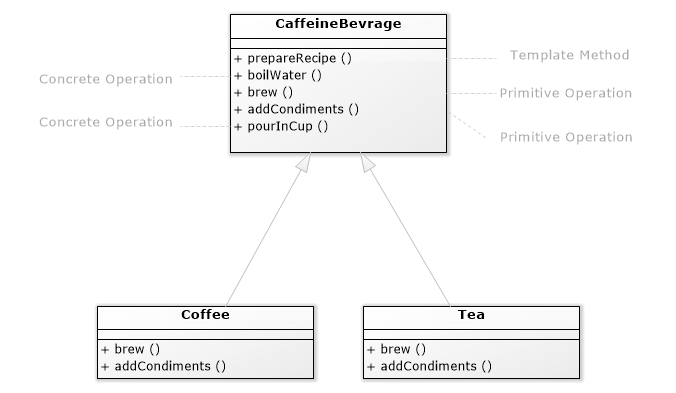
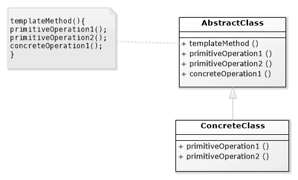

# Template Method Design Pattern (Encapsulating Algorithms)

- [Template Method Design Pattern (Encapsulating Algorithms)](#template-method-design-pattern-encapsulating-algorithms)
  - [Definitions](#definitions)
  - [The Problem](#the-problem)
      - [CaffeineBevrage Class](#caffeinebevrage-class)
      - [Tea Class](#tea-class)
      - [Coffee Class](#coffee-class)
    - [let's analyze the code](#lets-analyze-the-code)
    - [Template Method Pattern](#template-method-pattern)
  - [Let's make some coffee & tea](#lets-make-some-coffee--tea)
    - [Output](#output)
  - [Hook Method](#hook-method)
  - [Advantages](#advantages)
  - [When to use](#when-to-use)
  - [Credits](#credits)

## Definitions

**The Official Definition:**
The Template Method Pattern defines the skeleton
of an algorithm in a method, deferring some steps to
subclasses. Template Method lets subclasses redefine
certain steps of an algorithm without changing the
algorithm’s structure.
***
**What's Template Method?** it’s a method that defines an algorithm as a set of steps. One or more of these steps is defined to be abstract and implemented by a subclass. This ensures the algorithm’s structure stays unchanged, while subclasses provide some part of the implementation.

## The Problem

To make the pattern easier to grasp let's say we need to create a program for cafes this program will have the ability to prepare coffee and tea using the following recipes.

| Coffee Recipe | Tea Recipe |
|---|---|
| 1- Boil some water  | 1- Boil some water  |
| 2- Brew coffee in boiling water  | 2- Steep tea in boiling water  |
| 3- Pour coffee in cup  | 3- Pour tea in cup  |
| 4- Add sugar and milk  | 4- Add lemon  |

The `Coffee` class:

```dart
class Coffee {
  void prepareRecipe() {
    boilWater();
    brewCoffeeGrinds();
    pourInCup();
    addSugarAndMilk();
  }

  void boilWater() {
    print("Boiling water");
  }

  void brewCoffeeGrinds() {
    print("Dripping Coffee through filter");
  }

  void pourInCup() {
    print("Pouring into cup");
  }

  void addSugarAndMilk() {
    print("Adding Sugar and Milk");
  }
}
```

Each step is implemented as a separate method and all of these steps get called inside `prepareRecipe()` method.

The `Tea` class:

```dart
class Tea {
  void prepareRecipe() {
    boilWater();
    steepTeaBag();
    pourInCup();
    addLemon();
  }

  void boilWater() {
    print("Boiling water");
  }

  void steepTeaBag() {
    print("Steeping the tea");
  }

  void pourInCup() {
    print("Pouring into cup");
  }
   void addLemon() {
    print("Adding Lemon");
  }
}
```

If we compared both classes we will find out that both `boilWater()` and `pourInCup()` steps are identical in both classes so there's code duplication!

| Coffee  | = / ≠ |  Tea |
|---|---|---|
| `boilWater()` | =  | `boilWater()`  |
| `brewCoffeeGrinds()` | ≠  | `steepTeaBag()`  |
| `pourInCup()` | =  | `pourInCup()`  |
| `addSugarAndMilk()` | ≠  | `addLemon()`  |

To eliminate this duplication we could abstract the commonality into a base class.
let's create a class called `CaffineBeverage` that wraps the duplicated code.

Also if we had a closer look we will find that both algorithms are different in two steps that are special for the kind of the caffeine beverage we are making, so we could abstract these two steps so instead of `brewCoffeeGrinds()` and  `steepTeaBag()` steps we could make abstract step called `brew()`. and for the condiments we could abstract it to `addCondiments()`

the new design will look like this:

`CaffeineBevrage` will be implemented as an abstract class

#### CaffeineBevrage Class

```dart
import 'package:meta/meta.dart';

abstract class CaffeineBevrage {
  const CaffeineBevrage();

  @nonVirtual
  void prepareRecipe() {
    boilWater();
    brew();
    pourInCup();
    addCondiments();
  }

  void brew();
  void addCondiments();

  @nonVirtual
  void boilWater() {
    print('Boiling Water');
  }

  @nonVirtual
  void pourInCup() {
    print('Pouring into cup');
  }
}
```

#### Tea Class

```dart
class Tea extends CaffeineBevrage {
  @override
  void addCondiments() {
    print("Adding Lemon");
  }

  @override
  void brew() {
    print("Steeping the tea");
  }
}
```

#### Coffee Class

```dart
class Coffee extends CaffeineBevrage {
  @override
  void addCondiments() {
    print("Adding Sugar And Milk");
  }

  @override
  void brew() {
    print("Dripping Coffee through filter");
  }
}
```

Now you can see that we have improved the design a lot, we have removed the duplications, Hurray!

### let's analyze the code

`prepareRecipe()`
is called the template method. Why?

Because It serves as a template for an algorithm, in this case, an algorithm for making caffeinated beverages.

In the template, each step of the algorithm is represented by a method.

The `prepareRecipe()` method controls the algorithm. No one can change this, and it counts on subclasses to provide some or all of the implementation.

**Then how we could protect this method so that subclasses wouldn't be able to override it?**

Well unfortunately unlike programming languages like java where you could use `final` method declaration to prevent subclasses from overriding methods, dart doesn't provide a keyword for preventing that instead `package:meta` provides a `@nonVirtual` annotation to disallow overriding methods.

> Note that this annotations provides hints to dartanalyzer. They won't prevent violiating the annotations instead will cause warnings to be printed.

`boilWater()` & `pourInCup()`: are called *concrete operations* as they are reusable steps in both the tea and coffee recipes so it's implemented by the abstract class `CaffeineBeverage` and protected using the `@nonVirtual` annotation.

**But why is `brew()` & `addCondiments()` are abstract?**

These methods are called *primitive operations* because Coffee and Tea handle these
methods in different ways, they’re declared as abstract, to let the
subclasses worry about implementing these methods!

### Template Method Pattern

This pattern is all about creating a template for an algorithm. What’s a template? As you’ve seen it’s just a method; more specifically, it’s a method that defines an algorithm as a set of steps. One or more of these steps is defined to be abstract and implemented by a subclass. This ensures the algorithm’s structure stays unchanged,
while subclasses provide some part of the implementation.

The class diagram below shows the general structure of the design pattern.


- The *AbstractClass*: contains the template method and abstract versions of the operations used in the template method.

- The *templateMethod* makes use of the primitive & concrete operations to implement an algorithm. It is decoupled from the actual implementation of these operations.
  
- The *ConcreteClass* implements the abstract operations, which are called when the `templateMethod()` needs them, There may be many ConcreteClasses, each implementing the full set of operations required by the template method.

## Let's make some coffee & tea

```dart
void main(List<String> args) {
  final cupOfTea = Tea();
  cupOfTea.prepareRecipe();

  print("============");

  final cupOfCoffee = Coffee();
  cupOfCoffee.prepareRecipe();
}
```

`prepareRecipe()` => calls the algorithm methods which some are implemented by our `Tea` & `Coffee` classes and others are implemented already by the abstract class.

### Output

```text
Boiling Water
Steeping the tea
Pouring into cup
Adding Lemon
============
Boiling Water
Dripping Coffee through filter
Pouring into cup
Adding Sugar And Milk
```

## Hook Method

***Hook*** is a method that is declared in the abstract class but only given an empty or default implementation. This gives subclasses the ability to “hook into” the algorithm at various points if they wish; a subclass is also free to ignore the hook.
***
We could use the hook method to enhance our algorithm by making subclasses have the decision whether to invoke `addCondiments()` method or not.

To do this first we will modify `CaffeineBevrage` abstract class by adding a concrete method that decides whether to add condiments or not by default.

Let's say we will make it by default always adding condiments.

```dart
abstract class CaffeineBevrageWithHook {
          ...
  bool wantsCondiments() {
    return true;
  }
}
```

Next, we will modify our template method `prepareRecipe()` by adding a condition that decides whether to add condiments or not.

```dart
abstract class CaffeineBevrageWithHook {
  void prepareRecipe() {
    boilWater();
    brew();
    pourInCup();
    
    if (wantsCondiments()) {
      addCondiments();
    }
  }

                              ...
}
```

Now if we tested the code we will find the same output as previous, but if we want the user to decide we may override the `wantsCondiments()` method in one of our subclasses `Coffee` / `Tea` and provide a different implementation

```dart
class CoffeeWithHook extends CaffeineBevrageWithHook {
                          ....
  @override
  bool wantsCondiments() {
    print("Do you want to add Condiments? ");
    String? a = stdin.readLineSync(encoding: utf8);
    if (a != null && a.toLowerCase() == 'yes') {
      return true;
    } else {
      return false;
    }
  }
}
```

Now let's test the code

```sh
Boiling Water
Dripping Coffee through filter
Pouring into cup
Do you want to add Condiments? No
```

## Advantages

- The Abstract class runs the show; as it has the algorithm, and protects it.

- Maximizes reuse among the subclasses.

- The algorithm lives in one place and code changes only need to be made there.

- The Template Method Pattern provides a framework that other algorithms can be plugged into.

- The abstract class concentrates knowledge about the algorithm and relies on subclasses to provide complete implementations.

## When to use

## Credits

The example used in this article is from Head First Design Patterns 2nd edition.
